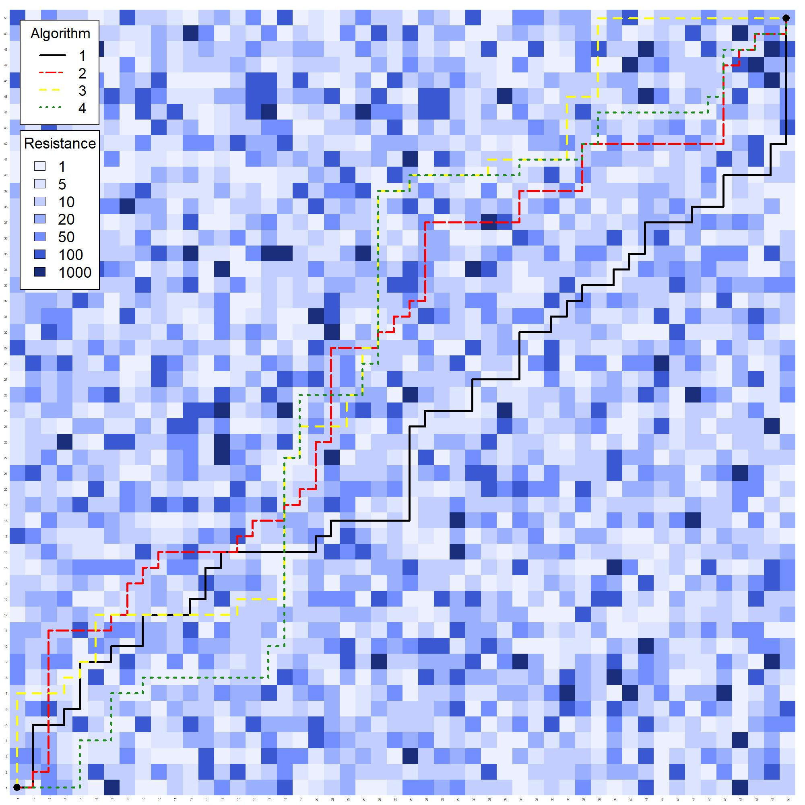
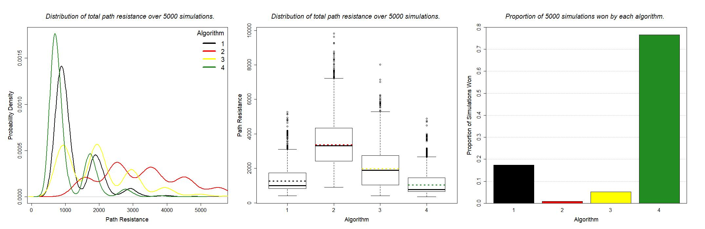

```{r setup, include = FALSE}

knitr::opts_chunk$set(echo = TRUE)

```

# Overview

This document provides information on the pathfinding algorithms used in this project, specifically addressing how the algorithms work as well as evaluating their advantages and disadvantages.

All pathfinding algorithms used in this project have the same general structure. At the beginning of each turn, a series of choices on where the path should go next are presented. A direction will then be chosen, the algorithm advances to the next turn, and then the cycle repeats itself.

The difference between the algorithms lies within their decision-making processes regarding which direction to choose. Each pathfinding algorithm consists of a different combination of one or more subroutines, where each subroutine makes a decision on the next cell in the path based on a different criterion. In algorithms where there are two or more subroutines, the order in which the subroutines are implemented affects the outcome, as the successful execution of a subroutine in each cycle precludes execution of the other sub routines. For example, consider the algorithm below:

```{r, eval = FALSE}

# Execute FLAR
choices <- FLAR(choices)
  
# Proceed to next turn if FLAR is successful
if(nrow(choices) == 1){
  c.next <- TRUE}
  
# If FLAR fails, execute FTCS
# Note that minimum of NAs is not a numeric, so we have to add another condition
if(nrow(choices) != 1 && !(NA %in% choices$ahead)){
  choices <- FTCS(choices)
  c.next <- TRUE}
  
# If FTCS fails, execute FRAN
if(nrow(choices) != 1){
  choices <- FRAN(choices)
  c.next <- TRUE}

```

`FLAR`, `FTCS`, and `FRAN` are all subroutines that will be discussed shortly. If the subroutine `FLAR` is successfully executed, the next turn indicator `c.next` is set to true and the turn is over, so `FTCS` and `FRAN` are skipped and will not be run. However, if `FLAR` fails, then `FTCS` is run and, if successful, then `FRAN` is skipped.

It should be noted that all of the subroutines discussed here only search in the forward direction (i.e. increasing *x*- and *y*- coordinates). These algorithms that use these subroutines thus also only search in the forward direction. Because of this, the paths can often be forced along the edges of the grid (where *x* = 50 or *y* = 50) and may encounter high-resistance areas that there is no way to circumvent. Algorithms that can move in all directions are likely much more effective because of their ability to avoid this pitfall and may be the subject of future work regarding this project.

# Subroutines

## Forward Random (FRAN)

##### *Description*

This subroutine selects one of two cells in the forward direction at random (**F**orward **Ran**dom, or `FRAN` for short). The resistance, *x*-coordinate, or *y*-coordinate is not considered in decision making when FRAN is applied. This subroutine should only be used when all other options are exhausted. The subroutine `FRAN` can be represented as follows:

```{r}

FRAN <- function(choices){
  rand <- sample(1:nrow(choices), size = 1)
  choices <- choices[rand, ]
  return(choices)}

```

##### *Strengths*

The strength of this subroutine is that it will always narrow the list of choices from two (or more) to one, as it makes a random selection rather than an informed decision based on criteria. Thus, this subroutine's most useful application is for breaking ties. For example, consider the following list of two choices given coordinates *x* = 40 and *y* = 40 for movement in the forward direction:

```{r, echo = FALSE}

choices.1 <- data.frame(cbind(c(41, 40), c(40, 41), c(5, 5)))
names(choices.1) <- c("x", "y", "r")

```

```{r}

choices.1

```

We would not be able to decide which cell to choose based on the resistance `r` of the possible choices because they are the same. Thus, we would have to either come up with a new criterion to evaluate our choices with or randomly choose using `FRAN`. Given that `FRAN` is really useful for breaking ties, it is often the "last resort" and is only used when all other subroutines fail.

##### *Weaknesses*

`FRAN` has major weaknesses and should only be used when all other options are exhausted. The most obvious shortcoming of this random subroutine is that, given a choice of cells with unequal resistances, the higher-resistance cell may be chosen purely by chance. Another issue is that this algorithm has no ability to detect anything beyond what is immediately adjacent to the current cell. For example, consider the choices from `choices.1` listed in the previous section, and suppose the first and second of those choices leads to first and second (respectively) sets of two more choices:

```{r, echo = FALSE}

choices.1a <- data.frame(cbind(c(42, 41), c(40, 41), c(5, 1000)))
names(choices.1a) <- c("x", "y", "r")
choices.1b <- data.frame(cbind(c(41, 40), c(41, 42), c(1000, 1000)))
names(choices.1b) <- c("x", "y", "r")

```

```{r}

choices.1a
choices.1b

```

It could be possible that the second choice in `choices.1` is selected at random, thus forcing the algorithm to select from two high resistance cells in `choices.1b`. As we will examine later, by searching several cells ahead, we can  minimise the chances of this occurring.

## Forward Lowest Adjacent Resistance (FLAR)

##### *Description*

This subroutine selects one of two cells in the forward based on which resistance value is the lowest (**F**orward **L**owest **A**djacent **R**esistance, or `FLAR` for short). The resistance is the only thing considered when making this decision. `FLAR` can be represented as follows:

```{r}

FLAR <- function(choices){
  choices <- subset(choices, r == min(r), select = c(x, y, r))
  return(choices)}

```

##### *Strengths*

One major strength of this subroutine is that it, unlike `FRAN`, makes decisions that attempt to minimise the total resistance of the path from start to end. This is useful, given that our objective is to find the path of least resistance from one corner of the grid to the other. Consider the following choices:

```{r, echo = FALSE}

choices.2 <- data.frame(cbind(c(41, 40), c(40, 41), c(1, 5)))
names(choices.2) <- c("x", "y", "r")

```

```{r}

choices.2

```

Suppose the first and second of those choices leads to first and second (respectively) sets of two more choices:

```{r, echo = FALSE}

choices.2a <- data.frame(cbind(c(42, 41), c(40, 41), c(5, 100)))
names(choices.2a) <- c("x", "y", "r")
choices.2b <- data.frame(cbind(c(41, 40), c(41, 42), c(100, 1000)))
names(choices.2b) <- c("x", "y", "r")

```

```{r}

choices.2a
choices.2b

```

If `FLAR` is applied to the first set of choices, we see that the the lowest-resistance choice of 1 is chosen. This leads the evaluation of `choices.2a`, and the lowest-resistance choice of 5 is chosen, giving a total path resistance of 6.

```{r}

FLAR(choices.2)
FLAR(choices.2a)

```

Given that the total path resistances for each of the four possible combinations of choices are 6, 101, 105, and 1005, the path that `FLAR` has chosen is indeed the path of least resistance. FLAR is simple but effective, and can be a more reliable tie-breaker than `FRAN` when other subroutines fail.

##### *Weaknesses*

Much like `FRAN`, `FLAR` lacks the ability to detect anything beyond what is immediately adjacent to the current cell. In the spirit of our previous examples, consider the choices in `choices.3`, and suppose the first and second of those choices leads to first and second (respectively) sets of two more choices:

```{r, echo = FALSE}

choices.3 <- data.frame(cbind(c(41, 40), c(40, 41), c(1, 5)))
names(choices.3) <- c("x", "y", "r")
choices.3a <- data.frame(cbind(c(42, 41), c(40, 41), c(100, 100)))
names(choices.3a) <- c("x", "y", "r")
choices.3b <- data.frame(cbind(c(41, 40), c(41, 42), c(100, 1)))
names(choices.3b) <- c("x", "y", "r")

```

```{r}

choices.3
choices.3a
choices.3b

```

If `FLAR` is applied to the first set of choices, we see that the the lowest-resistance choice of 1 is chosen. This leads the evaluation of `choices.2a`, where both options are high-resistance:

```{r}

FLAR(choices.3)
FLAR(choices.3a)

```

Had the subroutine been able to choose the second choice in `choices.3`, then a low-resistance option of 1 in `choices.3b` would have been available. Also note that `FLAR` is unsuccessful when applied to `choices.3a`, as it fails to return only one of the choices. In cases like this, `FRAN` would likely be used narrow the choices down to only one. Thus, even given the advantage that `FLAR` has over `FRAN`, it can still be tricked by being forced into high-resistance areas that immediately follow a low-resistance cell; such a fate will inevitably befall any subroutine that cannot look more than one cell ahead.

## Forward Neighbour Sum of Resistance (FNSR)

##### *Description*

This subroutine is the first of the subroutines discussed here that can search more than one cell ahead, and selects one of two cells in the forward based on which has the lowest total resistance in the 3 forward neighbour cells (**F**orward **N**eighbour **S**um of **R**esistance, or `FNSR` for short). The three forward neighbour cells have coordinates have coordinates (*x* + 1, *y*), (*x* + 1, *y* + 1), and (*x*, *y* + 1), and the total/combined resistance of these 3 cells is the only thing considered when making this decision. `FNSR` can be represented using the following function:

```{r}

FNSR <- function(choices){
  choices <- subset(choices, nn == min(nn), select = c(x, y, r, nn))
  return(choices)}

```

Here, `nn` represents the results from calculating the sum of resistances for the three forward neighbour cells.

##### *Strengths*

`FNSR` is the first subroutine discussed so far that has the ability to make decisions by looking beyond the immediately adjacent choices. This is especially useful for steering the path clear of areas that have high resistance. For example, take the grid below:

```{r, echo = FALSE}

field <- matrix(c(1, 1000, 5, 10, 10, 1, 
                  1, 1, 1, 100, 5, 1, 
                  1, 10, 100, 1000, 100, 1, 
                  5, 20, 1, 50, 1, 5,
                  100, 50, 1, 1, 20, 1,
                  50, 100, 1, 5, 1, 50),
                nrow = 6, byrow = TRUE)
colnames(field) <- 1:6
rownames(field) <- 1:6
par(mfrow = c(1, 2), mar = c(5, 2, 2.5, 2))
image(1:ncol(field), 1:nrow(field), t(field), breaks = c(0, 1, 5, 10, 20, 50, 100, 1000), 
      axes = FALSE, ann = FALSE, col =  c(rgb(r = 236, g = 240, b = 255, maxColorValue = 255),
                                          rgb(r = 220, g = 228, b = 255, maxColorValue = 255),
                                          rgb(r = 193, g = 206, b = 255, maxColorValue = 255),
                                          rgb(r = 155, g = 175, b = 255, maxColorValue = 255),
                                          rgb(r = 115, g = 143, b = 255, maxColorValue = 255),
                                          rgb(r = 58, g = 88, b = 209, maxColorValue = 255),
                                          rgb(r = 27, g = 46, b = 124, maxColorValue = 255)))
axis(side = 1, 1:ncol(field), colnames(field), tick = FALSE)
axis(side = 2, 1:nrow(field), rownames(field), tick = FALSE)
for(x in 1:ncol(field))
  for(y in 1:nrow(field))
    text(x, y, field[y, x])
image(1:ncol(field), 1:nrow(field), t(field), breaks = c(0, 1, 5, 10, 20, 50, 100, 1000), 
      axes = FALSE, ann = FALSE, col =  c(rgb(r = 236, g = 240, b = 255, maxColorValue = 255),
                                          rgb(r = 220, g = 228, b = 255, maxColorValue = 255),
                                          rgb(r = 193, g = 206, b = 255, maxColorValue = 255),
                                          rgb(r = 155, g = 175, b = 255, maxColorValue = 255),
                                          rgb(r = 115, g = 143, b = 255, maxColorValue = 255),
                                          rgb(r = 58, g = 88, b = 209, maxColorValue = 255),
                                          rgb(r = 27, g = 46, b = 124, maxColorValue = 255)))
axis(side = 1, 1:ncol(field), colnames(field), tick = FALSE)
axis(side = 4, 1:nrow(field), rownames(field), tick = FALSE)
points(x = 2, y = 2, col = "purple", pch = 8, cex = 3)
points(x = 2, y = 3, col = "red", pch = 3, cex = 2)
points(x = 3, y = 2, col = "red", pch = 4, cex = 2)
points(x = c(2, 3, 3), y = c(4, 4, 3), col = "red", pch = 3, cex = 1)
points(x = c(3, 4, 4), y = c(3, 3, 2), col = "red", pch = 4, cex = 1)

```

Here, the large red cross represents the first choice while the smaller red crosses represent the neighbouring cells in the forward direction; a similar logic regarding the second choice and its forward neighbours applies to the red *x*. The small red star is the overlap of a small red cross and red *x*, representing an overlap in groups of neighbours.

The current cell, represented by the large purple star, thus has two choices in the forward direction, with the first  indicated by the large red cross and the second by the large red x. These choices, as well as their resistance values and the sum of their three forward neighbours, are:

```{r, echo = FALSE}

choices.4 <- data.frame(cbind(c(2, 3), c(3, 2), c(10, 1), c(121, 1200)))
names(choices.4) <- c("x", "y", "r", "nn")

```

```{r}

choices.4

```

As we can see, the sum `nn` of the resistance values for three forward neighbours of the first choice is 121, which is significantly smaller than that of 1200 for the second choice. Thus, running `FNSR` will thus return the first choice since it has a smaller `nn`:

```{r}
FNSR(choices.4)
```

Had `FLAR` been implemented instead of `FNSR`, then the cell with the large red x would have been selected, and then the algorithm would be forced to choose between two high-resistance options.

##### *Weaknesses*

One significant weakness of `FNSR` is that it can be fooled by a single high-resistance cell having a disproportionate effect on the value of `nn`. For example, consider the following grid:

```{r, echo = FALSE}

field <- matrix(c(1, 1000, 5, 10, 10, 1, 
                  1, 1, 1, 5, 10, 1, 
                  1, 20, 20, 1000, 100, 1, 
                  5, 20, 10, 50, 1, 5,
                  100, 50, 20, 1, 20, 1,
                  50, 100, 1, 5, 1, 50),
                nrow = 6, byrow = TRUE)
colnames(field) <- 1:6
rownames(field) <- 1:6
par(mfrow = c(1, 2), mar = c(5, 2, 2.5, 2))
image(1:ncol(field), 1:nrow(field), t(field), breaks = c(0, 1, 5, 10, 20, 50, 100, 1000), 
      axes = FALSE, ann = FALSE, col =  c(rgb(r = 236, g = 240, b = 255, maxColorValue = 255),
                                          rgb(r = 220, g = 228, b = 255, maxColorValue = 255),
                                          rgb(r = 193, g = 206, b = 255, maxColorValue = 255),
                                          rgb(r = 155, g = 175, b = 255, maxColorValue = 255),
                                          rgb(r = 115, g = 143, b = 255, maxColorValue = 255),
                                          rgb(r = 58, g = 88, b = 209, maxColorValue = 255),
                                          rgb(r = 27, g = 46, b = 124, maxColorValue = 255)))
axis(side = 1, 1:ncol(field), colnames(field), tick = FALSE)
axis(side = 2, 1:nrow(field), rownames(field), tick = FALSE)
for(x in 1:ncol(field))
  for(y in 1:nrow(field))
    text(x, y, field[y, x])
image(1:ncol(field), 1:nrow(field), t(field), breaks = c(0, 1, 5, 10, 20, 50, 100, 1000), 
      axes = FALSE, ann = FALSE, col =  c(rgb(r = 236, g = 240, b = 255, maxColorValue = 255),
                                          rgb(r = 220, g = 228, b = 255, maxColorValue = 255),
                                          rgb(r = 193, g = 206, b = 255, maxColorValue = 255),
                                          rgb(r = 155, g = 175, b = 255, maxColorValue = 255),
                                          rgb(r = 115, g = 143, b = 255, maxColorValue = 255),
                                          rgb(r = 58, g = 88, b = 209, maxColorValue = 255),
                                          rgb(r = 27, g = 46, b = 124, maxColorValue = 255)))
axis(side = 1, 1:ncol(field), colnames(field), tick = FALSE)
axis(side = 4, 1:nrow(field), rownames(field), tick = FALSE)
points(x = 2, y = 2, col = "purple", pch = 8, cex = 3)
points(x = 2, y = 3, col = "red", pch = 3, cex = 2)
points(x = 3, y = 2, col = "red", pch = 4, cex = 2)
points(x = c(2, 3, 3), y = c(4, 4, 3), col = "red", pch = 3, cex = 1)
points(x = c(3, 4, 4), y = c(3, 3, 2), col = "red", pch = 4, cex = 1)

```

The current cell, denoted with the large purple star, has two choices; again, the first choice is indicated by the large red cross and the second by the large red *x*:

```{r, echo = FALSE}

choices.4 <- data.frame(cbind(c(2, 3), c(3, 2), c(20, 1), c(50, 1025)))
names(choices.4) <- c("x", "y", "r", "nn")

```

```{r}

choices.4

```

If `FNSR` were applied before any other subroutines, the first choice (red cross) would be selected:

```{r}

FNSR(choices.4)

```

This is not the ideal outcome because not only does the chosen cell have a higher resistance than the other possible choice, but future forward-direction choices along this path would have higher resistance as well. The other path (red *x*) should have been selected because it contains low-resistance cells that could be selected in future turns, but the cell with 1000 resistance disproportionately affected the sum `nn` and thus fooled `FNSR` into thinking it was a bad choice. For this reason, `FNSR` should not be used on its own but rather as a more-informed alternative to `FRAN` in tie-breaking situations.

## Forward Three-Cell and Four-Cell Searches (FTCS and FFCS)

##### *Description*

The first of these subroutines is the **F**orward **T**hree-**C**ell **S**earch, or `FTCS` for short. Given a  cell with two possible choices in the forward direction, for each choice, all possible combinations of 3 moves ahead of that choice are investigated and the combination with the lowest total resistance is selected. Note that the resistance of each choice is not included in determining total resistance; only the resistances of possible paths ahead of each choice are considered.

The second of these subroutines is the **F**orward **F**our-**C**ell **S**earch, or `FFCS` for short. This subroutine performs the same operation as `FTCS`, but then adds the lowest total resistance ahead for each choice to the resistance of that choice. Thus, a new total resistance for four cells ahead of the current cell (1 from choice plus 3 from search) is returned, and the lowest total is selected. These subroutines are defined such that:

```{r}

FTCS <- function(choices){
  choices <- subset(choices, ahead == min(ahead), select = c(x, y, r, ahead, total))
  return(choices)}

FFCS <- function(choices){
  choices <- subset(choices, total == min(total), select = c(x, y, r, ahead, total))
  return(choices)}

```

Here, `ahead` is the total resistance of the lowest-resistance path 3 cells ahead of each choice, and `total` is the resistance obtained by adding each `ahead` to its corresponding choice. That is, if one choice has a resistance of 10 and an `ahead` of 22 while the other choice has a resistance of 1 and an `ahead` of 106, then the respective values of `total` would be 32 and 107, as can be seen below:

```{r, echo = FALSE}

choices.5 <- data.frame(cbind(c(2, 3), c(3, 2), c(10, 1), c(22, 106), c(32, 107)))
names(choices.5) <- c("x", "y", "r", "ahead", "total")

```

``` {r}

choices.5

```

Given such choices, `FTCS` will make a selection based on the lowest value of `ahead` while `FFCS` will make a selection based on the lowest value of `total`. Though both subroutines technically look at cells up to four cells ahead of the current one, `FFCS` has certain advantages over `FTCS` that will be discussed shortly.

##### *Strengths*

Given that both of these subroutines can search several cells ahead, they make it significantly less likely for the path to be forced into a high resistance area. These subroutines have a strong advantage over the others because of this; `FRAN` and `FLAR` cannot look ahead of the immediately adjacent choices, while the searching power of `FTCS` is incredibly limited.

Consider the example above with `choices.5` and the corresponding grid below, with the purple star representing the current cell. The large red cross represents one of the two choices and the small red crosses represent the path of least resistance (lowest `ahead`) three cells ahead of that; a similar logic for the other choice applies to cells with a red *x*.

```{r, echo = FALSE}

field <- matrix(c(1, 1000, 5, 10, 10, 1, 
                  1, 1, 1, 100, 5, 1, 
                  1, 10, 1000, 50, 100, 1, 
                  5, 20, 1, 50, 1, 5,
                  100, 50, 1, 1, 20, 1,
                  50, 100, 1, 5, 1, 50),
                nrow = 6, byrow = TRUE)
colnames(field) <- 1:6
rownames(field) <- 1:6
par(mfrow = c(1, 2), mar = c(5, 2, 2.5, 2))
image(1:ncol(field), 1:nrow(field), t(field), breaks = c(0, 1, 5, 10, 20, 50, 100, 1000), 
      axes = FALSE, ann = FALSE, col =  c(rgb(r = 236, g = 240, b = 255, maxColorValue = 255),
                                          rgb(r = 220, g = 228, b = 255, maxColorValue = 255),
                                          rgb(r = 193, g = 206, b = 255, maxColorValue = 255),
                                          rgb(r = 155, g = 175, b = 255, maxColorValue = 255),
                                          rgb(r = 115, g = 143, b = 255, maxColorValue = 255),
                                          rgb(r = 58, g = 88, b = 209, maxColorValue = 255),
                                          rgb(r = 27, g = 46, b = 124, maxColorValue = 255)))
axis(side = 1, 1:ncol(field), colnames(field), tick = FALSE)
axis(side = 2, 1:nrow(field), rownames(field), tick = FALSE)
for(x in 1:ncol(field))
  for(y in 1:nrow(field))
    text(x, y, field[y, x])
image(1:ncol(field), 1:nrow(field), t(field), breaks = c(0, 1, 5, 10, 20, 50, 100, 1000), 
      axes = FALSE, ann = FALSE, col =  c(rgb(r = 236, g = 240, b = 255, maxColorValue = 255),
                                          rgb(r = 220, g = 228, b = 255, maxColorValue = 255),
                                          rgb(r = 193, g = 206, b = 255, maxColorValue = 255),
                                          rgb(r = 155, g = 175, b = 255, maxColorValue = 255),
                                          rgb(r = 115, g = 143, b = 255, maxColorValue = 255),
                                          rgb(r = 58, g = 88, b = 209, maxColorValue = 255),
                                          rgb(r = 27, g = 46, b = 124, maxColorValue = 255)))
axis(side = 1, 1:ncol(field), colnames(field), tick = FALSE)
axis(side = 4, 1:nrow(field), rownames(field), tick = FALSE)
points(x = 2, y = 2, col = "purple", pch = 8, cex = 3)
points(x = 2, y = 3, col = "red", pch = 3, cex = 2)
points(x = 3, y = 2, col = "red", pch = 4, cex = 2)
points(x = c(2, 3, 3), y = c(4, 4, 5), col = "red", pch = 3, cex = 1)
points(x = c(4, 5, 6), y = c(2, 2, 2), col = "red", pch = 4, cex = 1)

```

Had `FLAR` been implemented, the cell with the large red *x* would have been chosen because it has the lowest resistance of the two choices, but the path then would have been forced into a high-resistance area. `FTCS` and `FFCS` would have avoided this issue because the first choice, though having a higher resistance than the second, has a much lower-resistance 3-cell path (`ahead`) ahead of it as well as a lower total resistance (`total`) across the four cells. This can be seen below:

```{r}

FTCS(choices.5)
FFCS(choices.5)

```

It becomes evident that `FFCS` even has an advantage over `FTCS`; though they both look a total of four-cells ahead, unlike `FTCS`, `FFCS` incorporates the resistances of each current choice into calculating the total resistance of the best path forward. The importance of this can be seen in the following example.

```{r, echo = FALSE}

field <- matrix(c(1, 1000, 5, 10, 10, 1, 
                  1, 1, 5, 1, 20, 1, 
                  1, 1000, 1000, 50, 100, 1, 
                  5, 5, 10, 50, 1, 5,
                  100, 50, 5, 1, 20, 1,
                  50, 100, 1, 5, 1, 50),
                nrow = 6, byrow = TRUE)
colnames(field) <- 1:6
rownames(field) <- 1:6
par(mfrow = c(1, 2), mar = c(5, 2, 2.5, 2))
image(1:ncol(field), 1:nrow(field), t(field), breaks = c(0, 1, 5, 10, 20, 50, 100, 1000), 
      axes = FALSE, ann = FALSE, col =  c(rgb(r = 236, g = 240, b = 255, maxColorValue = 255),
                                          rgb(r = 220, g = 228, b = 255, maxColorValue = 255),
                                          rgb(r = 193, g = 206, b = 255, maxColorValue = 255),
                                          rgb(r = 155, g = 175, b = 255, maxColorValue = 255),
                                          rgb(r = 115, g = 143, b = 255, maxColorValue = 255),
                                          rgb(r = 58, g = 88, b = 209, maxColorValue = 255),
                                          rgb(r = 27, g = 46, b = 124, maxColorValue = 255)))
axis(side = 1, 1:ncol(field), colnames(field), tick = FALSE)
axis(side = 2, 1:nrow(field), rownames(field), tick = FALSE)
for(x in 1:ncol(field))
  for(y in 1:nrow(field))
    text(x, y, field[y, x])
image(1:ncol(field), 1:nrow(field), t(field), breaks = c(0, 1, 5, 10, 20, 50, 100, 1000), 
      axes = FALSE, ann = FALSE, col =  c(rgb(r = 236, g = 240, b = 255, maxColorValue = 255),
                                          rgb(r = 220, g = 228, b = 255, maxColorValue = 255),
                                          rgb(r = 193, g = 206, b = 255, maxColorValue = 255),
                                          rgb(r = 155, g = 175, b = 255, maxColorValue = 255),
                                          rgb(r = 115, g = 143, b = 255, maxColorValue = 255),
                                          rgb(r = 58, g = 88, b = 209, maxColorValue = 255),
                                          rgb(r = 27, g = 46, b = 124, maxColorValue = 255)))
axis(side = 1, 1:ncol(field), colnames(field), tick = FALSE)
axis(side = 4, 1:nrow(field), rownames(field), tick = FALSE)
points(x = 2, y = 2, col = "purple", pch = 8, cex = 3)
points(x = 2, y = 3, col = "red", pch = 3, cex = 2)
points(x = 3, y = 2, col = "red", pch = 4, cex = 2)
points(x = c(2, 3, 3), y = c(4, 4, 5), col = "red", pch = 3, cex = 1)
points(x = c(4, 5, 6), y = c(2, 2, 2), col = "red", pch = 4, cex = 1)

```

Each choice, along with the 3-cell-ahead resistance and the 4-cell total resistance, are shown below.

```{r, echo = FALSE}

choices.6 <- data.frame(cbind(c(2, 3), c(3, 2), c(5, 1000), c(22, 20), c(27, 1020)))
names(choices.6) <- c("x", "y", "r", "ahead", "total")

```

```{r}

choices.6

```

If `FTCS` is implemented, then the path with red crosses is chosen since the three-cell path ahead of the red star (choice 2) has a lower total resistance than the three-cell path ahead of the red *x* (choice 1). Yet this path has a higher resistance! If `FFCS` is implemented, though, the lowest-resistance path is chosen.

```{r}

FTCS(choices.6)
FFCS(choices.6)

```

In general, because `FFCS` calculates the total resistance four cells ahead of the current cell while `FTCS` only calculates it 3 cells ahead of each choice, `FFCS` will usually outperform `FTCS`.

##### *Weaknesses*

`FTCS` and `FFCS` are more computationally expensive than any of the other subroutines. If there are 2 choices in the forward direction for any cell, then there are a total of $2^{3} = 8$ possible paths for `FTCS` and $2^{4} = 16$ possible paths for `FFCS`. In general, if we want to look $n$ cells ahead of the current cell, then there are a total of $2^{n}$ possible paths (assuming edge cases do not occur). Given the restriction of forward movement, it will always take 98 moves to get from the start to end, so the number of possible paths can get quite large.

Neither of these subroutines handle edge cases well, with their searching power being greatly diminished within 2-3 cells of the grid boundary since the subroutine obviously can't search beyond the boundary. In instances where this occurs, the distance searched ahead is limited to the number of cells between the current position and the boundary; for example, if the current cell is at $x = 40$ and $y = 48$, then both `FTCS` and `FFCS` will only search 2 cells ahead. If the current cell is along the boundary, then neither `FTCS` or `FFCS` are executed; the same occurs if one cell from the boundary, since looking ahead only one cell is just the equivalent of using `FLAR`.

# Algorithms

Now that we have defined and explained the subroutines that will be used in the pathfinding algorithms, we define the algorithms themselves. Each of the following four algorithms implements subroutines in the specified order and if a particular subroutine fails, the next in the list is selected until a subroutine is successfully executed.

##### *Algorithm 1*

This algorithm focuses only on examining directly adjacent cells and uses `FLAR` to make decisions. The order of subroutine implementation is: `FLAR`, `FRAN`.

##### *Algorithm 2*

This algorithm focuses on examining nearby neighbours ahead of each adjacent cell and mainly uses `FNSR` to make decisions, with `FLAR` as a backup. The order of subroutine implementation is: `FNSR`, `FLAR`, `FRAN`.

##### *Algorithm 3*

This algorithm searches several cells ahead of each adjacent cell to spot potential areas of high-resistance and mainly uses `FTCS` to make decisions, with `FLAR` as a backup. The order of subroutine implementation is: `FTCS`, `FLAR`, `FRAN`.

##### *Algorithm 4*

This algorithm is an enhanced version of Algorithm 3, replacing `FTCS` with `FFCS`. The order of subroutine implementation is: `FFCS`, `FLAR`, `FRAN`.

# Algorithm Performance

Now, we examine algorithm performance on randomly-generated terrain to see which of the four algorithms performs the best. An example of a single run on a randomly-generated terrain map can be seen below.

```{r echo = FALSE, out.width = "470px", out.height = "470px"}



```

Here, Algorithm 4 is the clear winner, as it is able to map out a low-resistance map and does not encounter any cells with resistance values higher than 50. Algorithm 2 performs extremely poorly, running through several cells with resistance values of 100 and even a cell with a resistance value of 1000. Algorithms 1 and 3 perform fairly well in the beginning, but then are forced along the edge of the grid near the end and thus encounter several high-resistance cells.

However, we note that the results above are from just a single run of the four algorithms on a single terrain map. We can better assess algorithm performance by simulating a large number of randomly-generated terrain maps and then running the four algorithms on each map; the results of doing so with 5000 replications are shown below.

```{r echo = FALSE, out.width = "470px", out.height = "470px"}



```

Here, we see that Algorithm 2 performs extremely poorly; its mean and median total path resistance are much higher than those of the other three algorithms, and it wins an extremely low proportion of the simulations. On the contrary, Algorithm 4 is the obvious winner; not only does it have the lowest mean and median total path resistance, but it wins an overwhelming amount (approximately 76%) of the simulations.

Algorithms 1 and 3 fall between the poor performance of Algorithm 2 and the excellent performance of Algorithm 4. While Algorithm 3 performs better than Algorithm 2 in terms of mean and median total path resistance, it fails to outperform Algorithms 1 and 4 on that front, and wins only 5% of the simulations. Algorithm 1 performs only slightly worse in terms of mean and median total path resistance when compared to Algorithm 4, but this slight difference really matters, as the percentage of simulations won by Algorithm 1 is still dwarfed by that of Algorithm 4.

# Conclusions

Here, we compare four different pathfinding algorithms in order to see which one can most effectively navigate through a randomly-generated terrain map, with each algorithm made up of a different set of subroutines designed to score possible choices of path based on resistance. For the sake of simplicity, movement is restricted to the forward direction, thus creating the challenge of algorithms running into high-resistance areas that they cannot escape; some algorithms, especially those with subroutines that have the ability to search several cells forward, are better adapted to avoid this issue than others.

We first address how the subroutines behind the algorithms work, evaluating their advantages and disadvantages while providing concrete examples of possible pitfalls that each subroutine may run into. Here, we define five subroutines: `FRAN` (Forward Random), `FLAR` (Forward Lowest Adjacent Resistance), `FNSR` (Forward Neighbour Sum of Resistance), `FTCS` (Forward Three-Cell Search), and `FFCS` (Forward Four-Cell Search).

We then describe the structure of each of the four algorithms, including the subroutines that define them and the order in which subroutines are executed. All algorithms here have the same general structure: a series of choices on where the path should go next are presented at the beginning of each turn, a direction is then be chosen, the algorithm advances to the next turn, and then the cycle repeats itself.

Finally, we evaluate algorithm performance on 5000 randomly-generated terrain maps. Here, we find that the algorithm that searches four cells ahead and breaks ties based on directly adjacent cells before breaking ties randomly outperforms the other three algorithms, with this particular algorithm having the lowest mean and median total path resistance and winning approximately 76% of all simulations.

